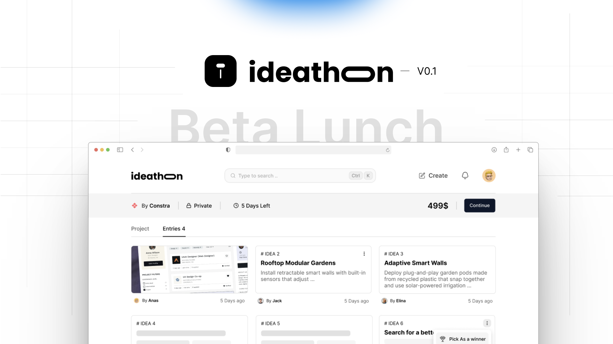

  

# Ideathon

**Ideathon is a platform where ideas grow stronger together.** It's a space where individuals, startups, and organizations can launch short idea challenges—called *ideathons*—to gather fresh perspectives, test assumptions, and spark innovation.

As a **host**, you post your idea, problem, or challenge. As a **participant**, you submit improvements, alternatives, or bold new directions. At the end, the best idea rises to the top, and sometimes even wins a prize.

Think of it as a mix between **brainstorming and competition**—fast, collaborative, and rewarding.

Whether you want to **validate a product concept, crowdsource creative solutions, or simply challenge your community to think differently**, Ideathon gives you the tools to make it happen.

**Brilliant minds think differently — together.**

---

## Who is it for

### Hosts
- Entrepreneurs and startup teams validating product-market fit
- Product and UX teams testing features or flows
- Companies and non-profits sourcing creative solutions
- Educators and program managers running structured creativity exercises

### Participants
- Designers, developers, and domain experts demonstrating skills
- Students and early-career creatives building portfolios
- Subject-matter enthusiasts who enjoy solving real problems
- Anyone who wants to contribute ideas and gain recognition

---

## Features

### User profiles
- Contact information
- Ideathons created
- Ideathons participated in

### Discovery and filtering
- Browse ideathons by category
- Full-text search across ideathons and submissions
- Category tags and filters for faster discovery

### Notifications
- Alerts for new ideathons, submission updates, and wins

### Host capabilities (Business)
- Create new ideathons
- Configure visibility (public or private)
- Set deadlines and optional prizes
- Manage entries and select winners

### Participant capabilities (Client)
- Browse and filter active ideathons
- Submit entries (improvements, alternatives, or new concepts)
- View all submissions after the ideathon concludes
- Compete for prizes and recognition

---

## Getting started

**Hosted SaaS:** https://idea-thon.vercel.app/ (beta — free)

Sign up, create your profile, then either start an ideathon or join one that interests you.
